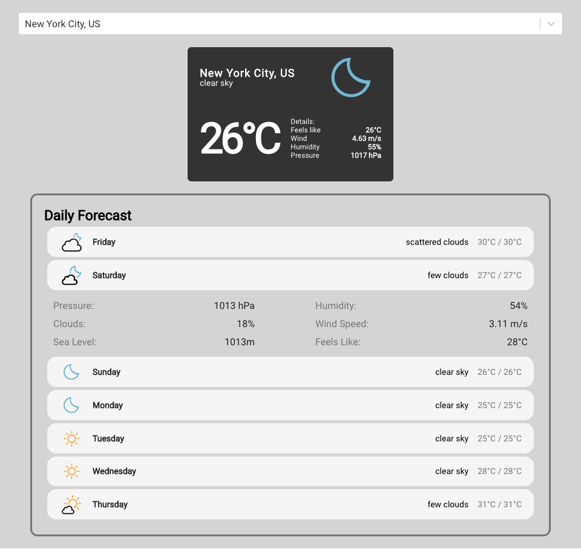

# Weather Application

Weather Application is a react app for searching current weather and the week's forecast using two APIs. The app allows you to type in the first few characters of a city and it auto-completes the search.

## Links

- [Live Demo](https://weather-forecast-app-client.herokuapp.com/)

## Screenshots

### Home Page:

## Technology

### Built with:

- React, including useState and useEffect

  - Created with [create-react-app](https://github.com/facebook/create-react-app)

### API Interface:

Built to interface with Weather app (free to use):

- [OpenWeather API](https://openweathermap.org/)
- [Rapid API](https://rapidapi.com/wirefreethought/api/geodb-cities/)
